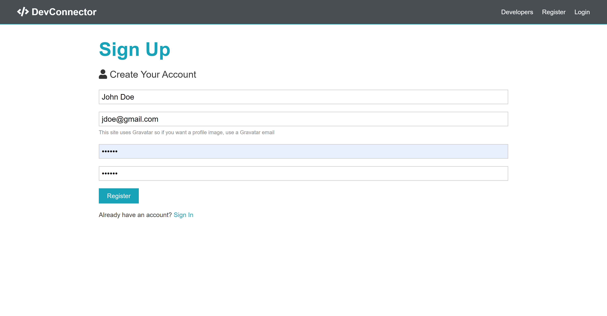
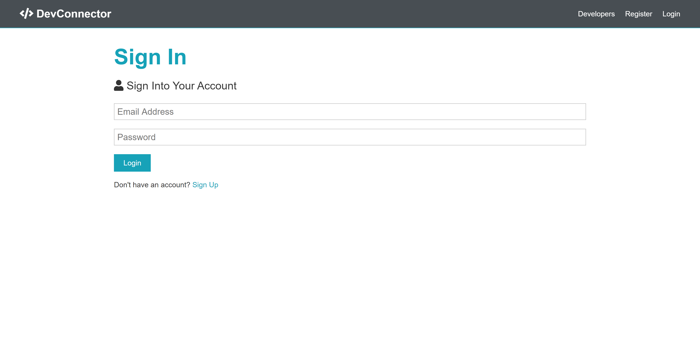
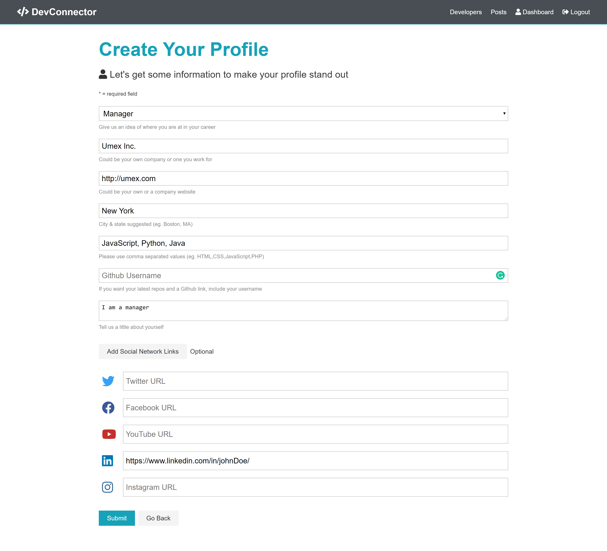
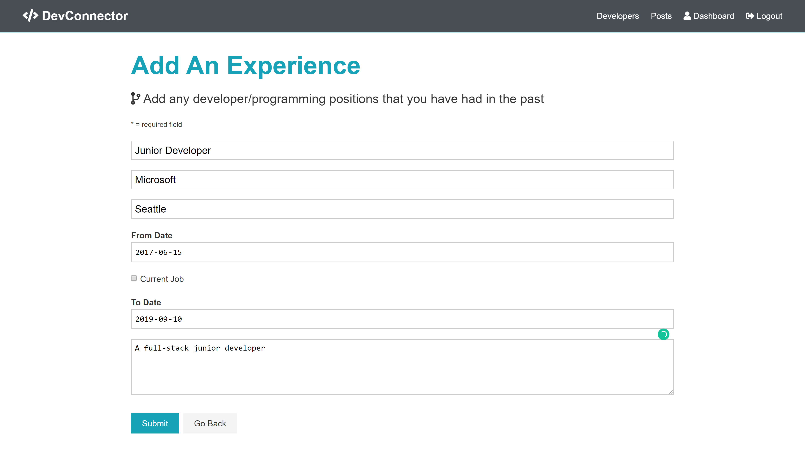
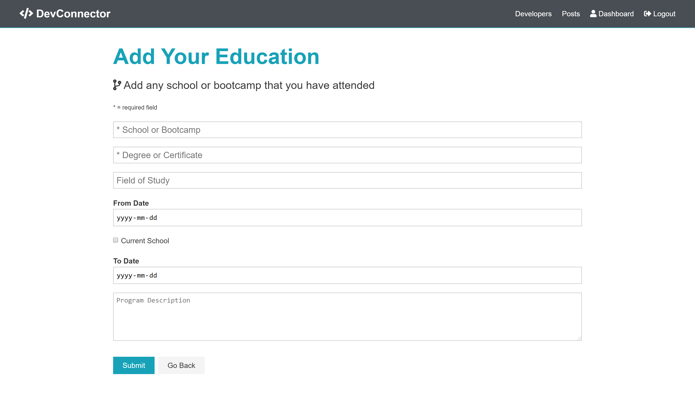
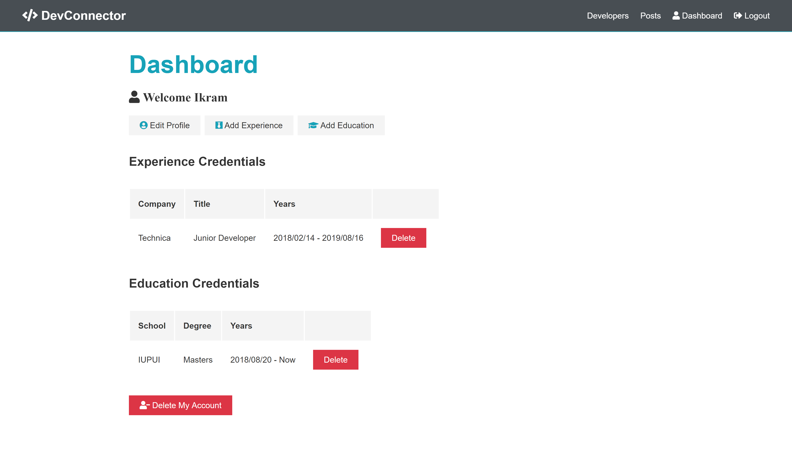
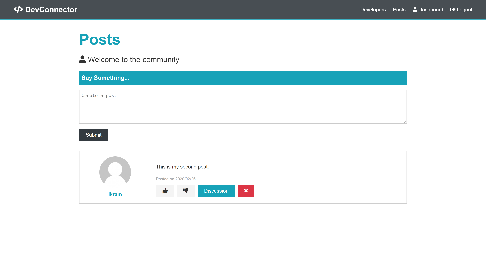
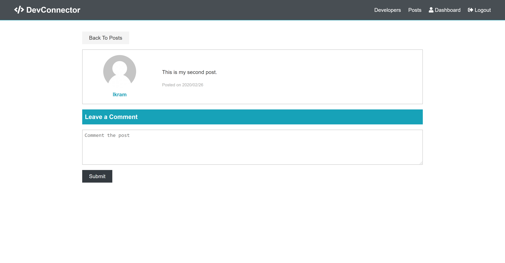
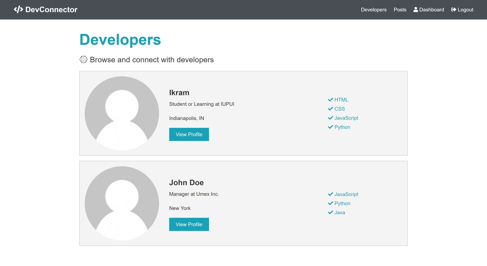

# devConnector

This is a MERN stack application from the "MERN Stack Front To Back" course on Udemy. It is a small social network app that includes authentication, profiles and forum posts.

## Quick Start

### Inside the config folder, create a file called default.json with the following:

```
{
  "mongoURI": "<your_mongoDB_Atlas_uri_with_credentials>",
  "jwtSecret": "secret",
  "githubToken": ""
}
```

### Install server dependencies

```
npm install
```

### Install client dependencies

```
cd client
npm install
```

### Run both Express & React from root

```
npm run dev
```

### Build for production

```
cd client
npm run build
```

## Screenshots

### HOME


### REGISTER



### LOGIN



### CREATE PROFILE



### ADD EXPERIENCE



### ADD EDUCATION



### DASHBOARD



### VIEW ALL POSTS



### COMMENT ON A POST



### VIEW ALL DEVELOPERS


